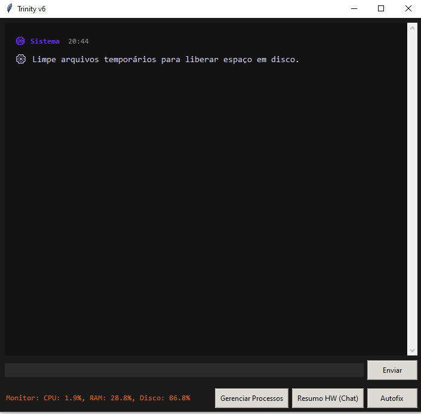
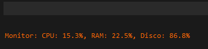
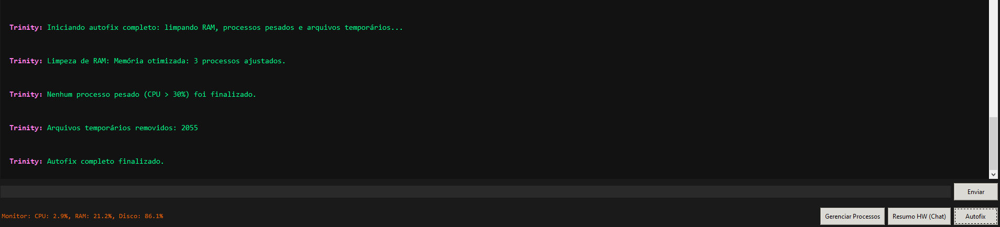
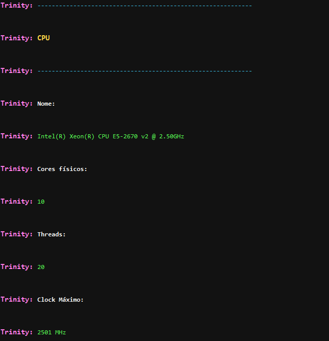
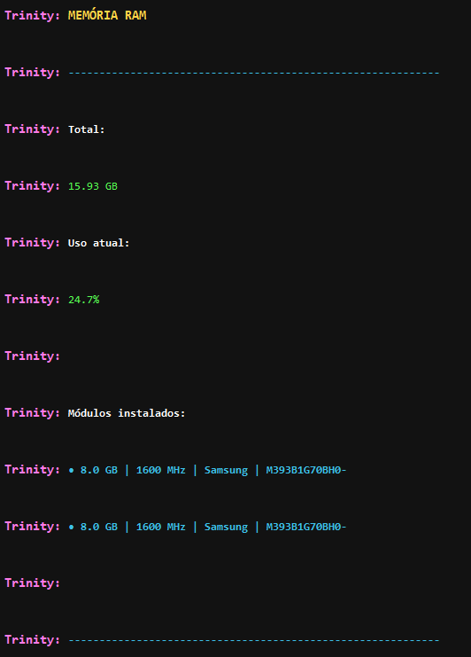
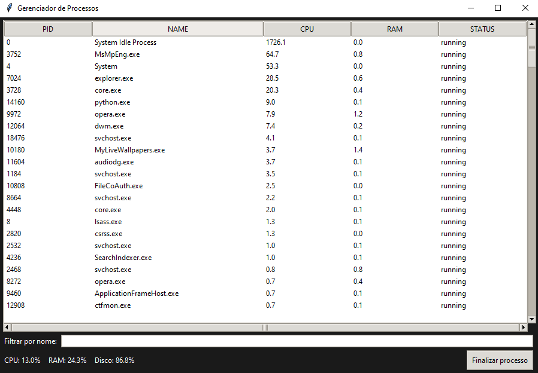
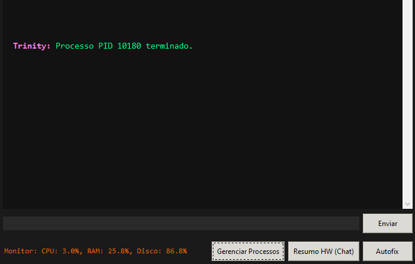

# Trinity AI


> A modular desktop AI assistant built with Python, Tkinter, real-time streaming, persistent memory, and system monitoring.

## Overview

Trinity AI is a desktop assistant project focused on creating a more interactive, contextual, and modular AI experience.

Instead of being just a simple chatbot, Trinity combines a graphical desktop interface with real-time response streaming, persistent memory, intent analysis, and system monitoring features.

The project was built with a strong focus on modularity, maintainability, and future scalability.

---

## Key Features 🚀

- Real-time streamed AI responses
- Desktop GUI built with Tkinter
- Persistent memory and fact storage
- Intent parsing and response routing
- Hardware and system monitoring
- Proactive assistant behavior
- Modular code architecture
- Custom assistant identity and future visual integration

---

## Tech Stack

- Python
- Tkinter
- OpenAI API
- psutil
- WMI
- JSON-based persistence
- Modular local architecture
- Future feature: ElevenLabs
- Future feature: Trinity's official website built with HTML5, CSS3 and Java.


  
---

## Project Structure

```
Trinity-AI/
├─ README.md
├─ .gitignore
├─ requirements.txt
├─ .env.example
├─ Trinity/
│  ├─ core/
│  ├─ ui/
│  ├─ utils/
│  ├─ system/
│  ├─ backend_storage/
│  ├─ hardware_info/
│  └─ settings/
│  └─ screenshots/
│  └─ memory/
│  └─ logs/
│  └─ cache/

```


# How It Works 🧠

Trinity follows a modular flow:

1. The user sends a message through the desktop interface.
2. The input is interpreted by the assistant logic.
3. Memory modules determine whether previous context should be retrieved.
4. The language model generates a streamed response.
5. The interface renders the response in real time.
6. Relevant information can be stored for future use.
7. Monitoring modules can detect system conditions and trigger proactive assistant behaviors.


# Installation ⚙️
```
1. Clone the repository:

git clone https://github.com/TrinityPrimeAi/Trinity-AI.git

cd Trinity-AI
__________________________________________________________
2. Create a virtual environment
   
python -m venv .venv
__________________________________________________________
3. Activate the virtual environment

Windows
.venv\Scripts\activate

Linux / macOS
source .venv/bin/activate

__________________________________________________________
4. Install dependencies
pip install -r requirements.txt

__________________________________________________________
5. Configure environment variables:

- Create a .env file in the project root:
OPENAI_API_KEY=your_api_key_here

__________________________________________________________
6. Running the Project:

python main.py

__________________________________________________________
```


# Development Principles

This project follows a simple rule:

Do not change anything that is not necessary. If something works, it should remain.

This principle helps preserve stability while allowing the architecture to evolve safely.


# Roadmap

Current:
- Modular Python architecture
- Tkinter desktop interface
- Response streaming pipeline
- Persistent memory foundation
- Facts manager
- Hardware and system monitoring

Next Steps:

- Improve streaming reliability
- Refine memory vs general-knowledge routing
- Expand proactive assistant logic
- Improve modular separation
- Add richer assistant visual states
- Prepare for a SaaS-ready multi-user architecture


# Project Status

Trinity is currently under active development.
The project already has a functional modular foundation, and the current focus is on improving streaming behavior, memory logic, and intelligent routing between stored context and general knowledge.


```md
## 📸 Screenshots

### System Monitoring




### Autofix Button



### Hardware Information




### Trinity's Task Manager





# Why This Project Matters

Trinity is an attempt to build a desktop AI assistant that becomes more useful, contextual, and interactive over time.
It explores how memory, monitoring, modularity, and real-time interface behavior can be combined into a more complete assistant experience.

